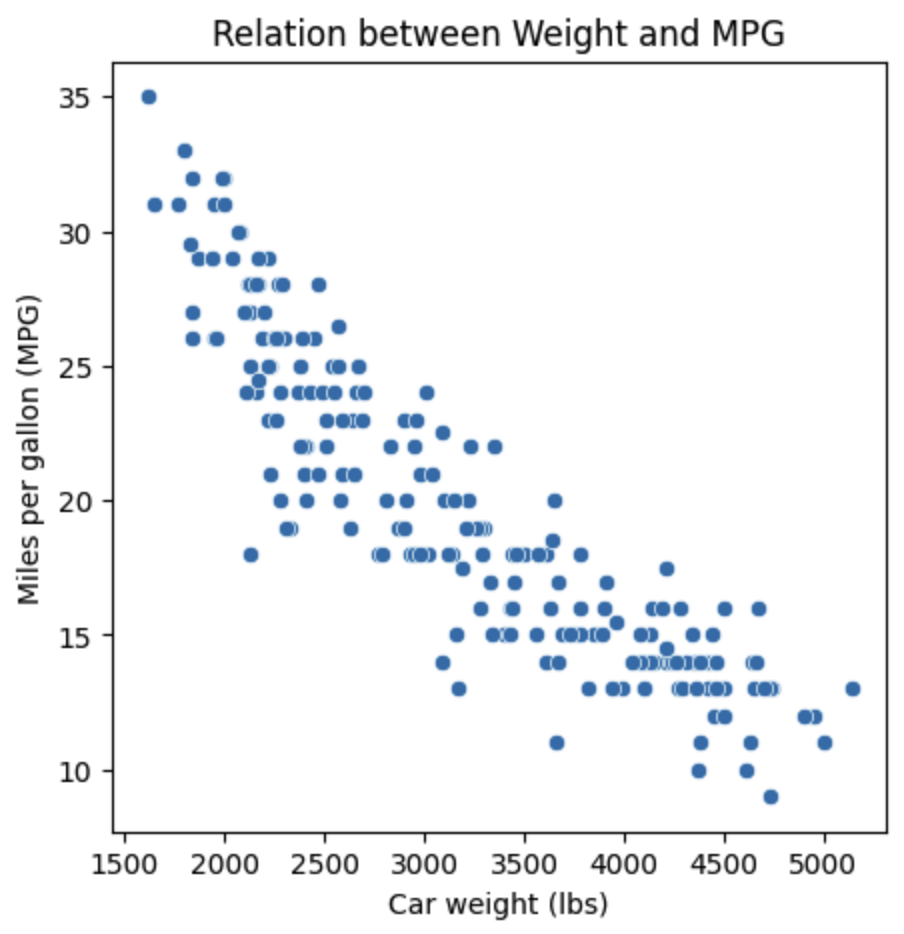
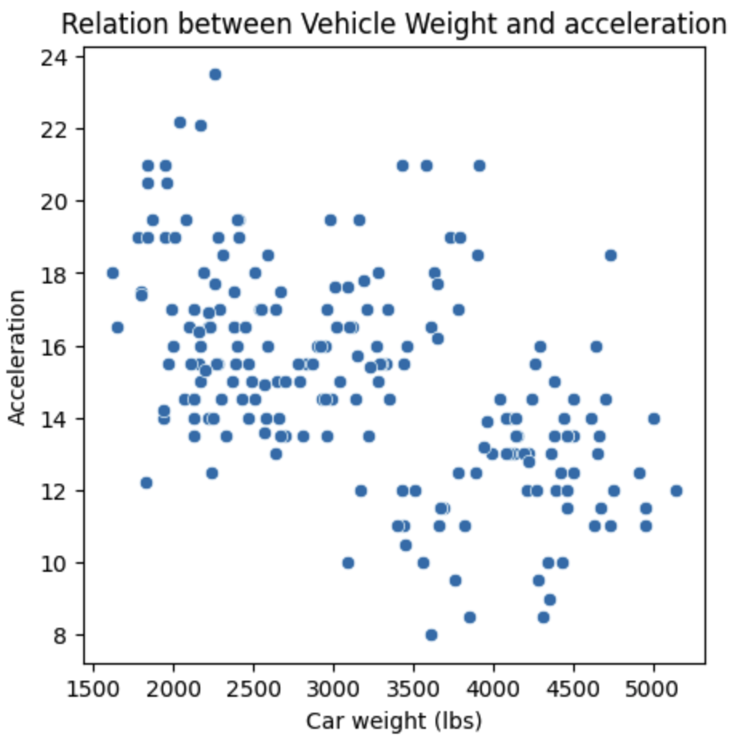
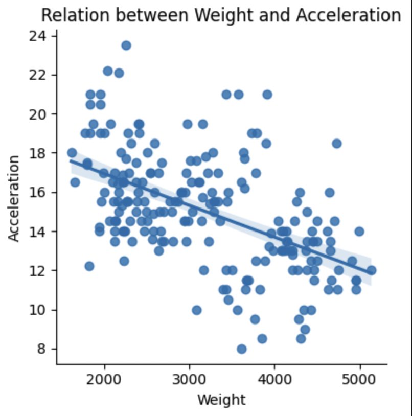

Describe:
              mpg   cylinders  ...        year      origin
count  392.000000  392.000000  ...  392.000000  392.000000
mean    23.445918    5.471939  ...   75.979592    1.576531
std      7.805007    1.705783  ...    3.683737    0.805518
min      9.000000    3.000000  ...   70.000000    1.000000
25%     17.000000    4.000000  ...   73.000000    1.000000
50%     22.750000    4.000000  ...   76.000000    1.000000
75%     29.000000    8.000000  ...   79.000000    2.000000
max     46.600000    8.000000  ...   82.000000    3.000000

[8 rows x 8 columns]

